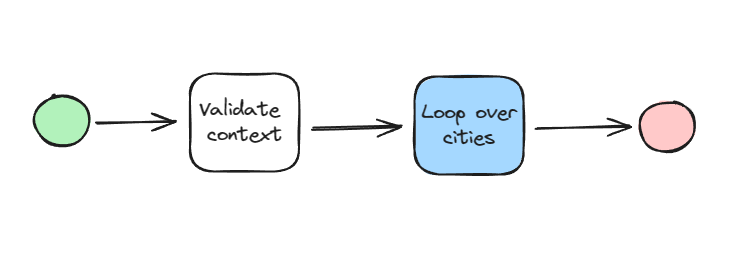
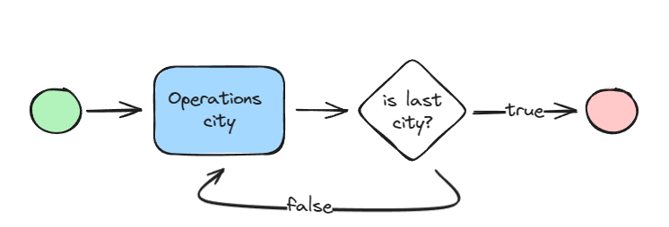

# ez-flow-test

This application test aims to demonstrate [@rs-box/ez-flow](https://github.com/rstanziale/ez-flow) functions.

## Use case

To test the library, a use case scenario was built in which, given a list of Italian cities, I wish to perform certain operations on each city and produce results.

To achieve this, it was important to first define the available inputs and what the workflow wanted to obtain, in this case the cumulative data on the regions to which the cities belong.

## Workflows definition

Specifically, three workflows were built:
* **Main** workflow
* **Loop over cities** workflow
* **Operations** workflow

### Main

This is the main workflow, a *Sequential Flow* that performs two operations:
* Validate the context given as input (*ValidateContext* unit).
* Calling the *Loop over cities* workflow.



### Loop over cities

This is a *Repeat Flow*, it will run until the *IsNotLastCity* predicate returns a negative value



### Operations city

This is a *Parallel Flow* that executes the list of units passed as input, in the specific case of this test it will perform the following actions:
* Print the city name
* Update the cumulative region data.


### Complete

This is the complete workflow resulting from the combination of those shown above.


## Result

Finally, the workflow described above is translated as follows:

```typescript
const workflow = SequentialFlow.Builder.newFlow()
  .withName('Main workflow')
  .addWork(new ValidateContextWork())
  .addWork(
    RepeatFlow.Builder.newFlow()
      .withName('Loop over cities')
      .withWork(
        ParallelFlow.Builder.newFlow()
          .withName('Operations city')
          .withWorks([new PrintCityWork(), new RegionCity()])
          .build(),
      )
      .until(new IsNotLastCityPredicate())
      .build(),
  )
  .build();
  ```